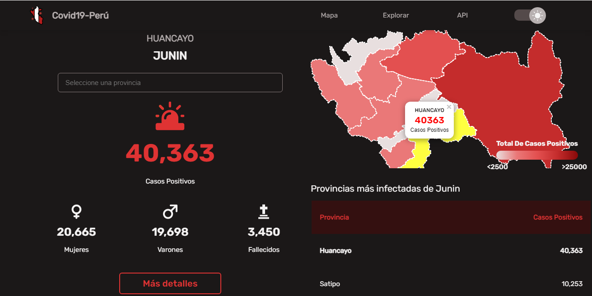

# API Covid19 - Perú

[](https://www.covi19peru.com)

**Servicio de API** que te provee toda la información necesaria sobre el estado del **COVID-19** a nivel nacional, departamental y provincial en el **Perú**.

Esta aplicación le proporciona información sobre el estado del COVID-19 en los 25 departamentos y 196 provincias que conforman al Perú, y a nivel nacional, cada una de estas informaciones contiene datos como la cantidad de casos positivos en sus diferentes variaciones (total, hombres y mujeres), cantidad de decesos (total, hombre, mujeres y por etapa de vida), cantidad poblacional demográfica y el año, mes y día de cuando fue recopilado cada uno de estos datos, así como también poder recuperar la información en los ultimos n° días.

**NOTA: Está API fue elaborada gracias a los datos abiertos que nos provee el MINSA sobre el estado del COVID-19 en el Perú (https://covid19.minsa.gob.pe/sala_situacional.asp)**

**LENGUAJES Y PROGRAMAS USADOS:**
Backend | Frontend
------------ | -------------
NodeJS | React
Python | Styled Components
Redis |
QGIS

**ENLACES PARA ENTENDER MEJOR LA APP:**
* [Tutorial sobre la aplicación]()
* [Tutorial para scrapear datos masivos]()

## Cómo Contribuir Al Proyecto? 
1. Hacer fork del proyecto

    

2. Clonar rama fork
    ```git
      git clone https://github.com/_nameuser_/COVID19Peru-Backend.git
    ```

3. Instalar los paquetes especificados

   Para NodeJS
   ```bash
      npm install
   ```
   Para Python
   * _En windows_ 
     ```bash
        pip install
     ```
   
   * _En Linux_
     ```bash
        pip3 install
     ```

4. Ejecutar aplicación
   ```bash
      npm run dev
   ```
5. Realizar cambios y pushearlos
    ```git
      git push origin main
    ```
6. Comparar y crear PR

   
  
7. A esperar el mergeo del PR ✿◡‿◡

**IMPORTANTE:** Para correr esta aplicación tienes que tener instalado _NodeJS_ y _Python_

## Acerca de los PRs
  * **No hagas PRs para refactorizar código o cambiar la estructura del proyecto (carpetas)**, la idea es añadir más funcionalidades
  
  * Puedes añadir PRs que enriquezcan el contenido de las APIS

## Recomendaciones de cambios que puedes realizar
- [ ] Añadir URLs de imagen por cada departamento o provincia en las APIs implementadas.
- [ ] Añadir datos respecto a la población demográfica por cada departamento o provincia en las APIS implementadas.
- [ ] Crear nuevas APIs respecto al estado de vacunación en el Perú.


  


